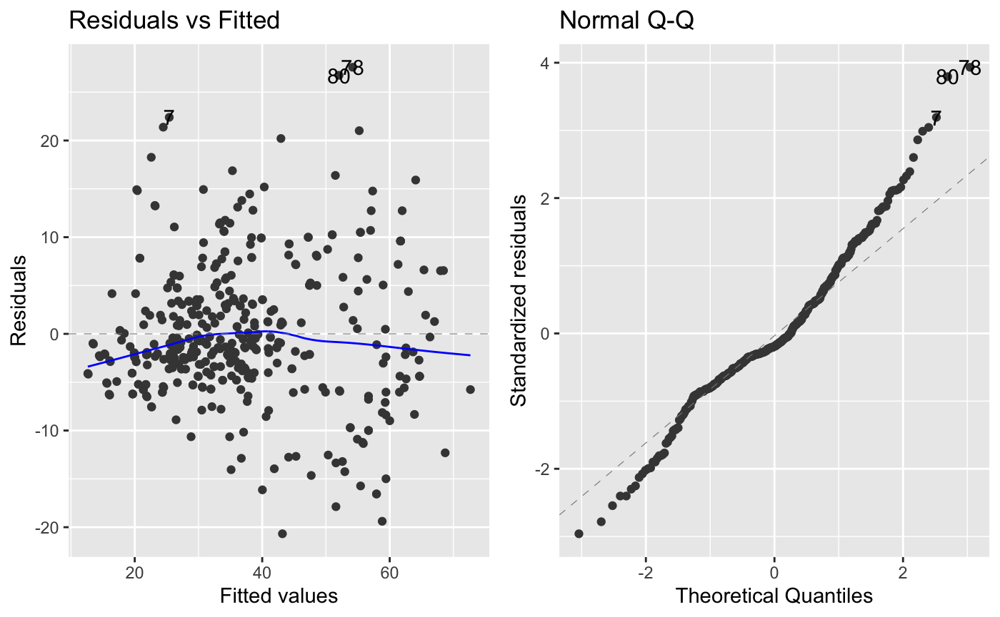

```{r, include=FALSE, warning=FALSE, message=FALSE}
#Required to Run
#install.packages("xaringan")
```

# Introduction

### Aim
-  Demonstrate the possibilities of adapting Multiple Linear Regression (MLR) to predict the compressive concrete strength of 28 days using the Concrete dataset

### Questions
- Are all variables in our dataset significant in predicting the compressive concrete strength of 28 days?

- What is the most significant factor in predicting the compressive concrete strength of 28 days?

### Results

- Super Plasticizer is not significant in predicting the compressive concrete strength of 28 days 

- Cement is the most significant factors in predicting compressive concrete strength of 28 days

---
# Data Description

#### The dataset  allocated to Group 6 is *Concrete Strength* dataset.

### Data source
>This datast can be found on the UCI machine learning repository,
link: https://archive.ics.uci.edu/ml/datasets/concrete+compressive+strength 


It is donated by its original owner --- Prof. I-Cheng Yeh, Department of Information Management, chung-Hua University, Hsin Chu, Taiwan 30067, R.O.C.   
(*How has these data been collected? *)
### Data summary
- 1030 observations with 9 quantitative variables 
- 1 dependent variable: Compressive Concrete Strength
- 8 independent variables: Cement, Blast Furnace Slag, Fly Ash, Water, Superplasticizer, Coarse Aggregate,
Fine Aggregate and Age

---

background-image: url("https://i.imgflip.com/34rr4v.jpg")
background-position: 95% 30%
background-size: 20%

<!-- Image Credit: [Imgflip] https://i.imgflip.com/34rr4v.jpg -->

# Data Cleaning & Filtering

```{r echo=FALSE, message = FALSE, warning = FALSE}
library(tidyverse)
library(moonBook)
library(webr)
library(sjPlot)
library(GGally)
library(qtlcharts)
library(ggfortify)
library(caret)

y = readxl::read_excel("data/Concrete_Data.xls") %>% janitor::clean_names()
colnames(y)[1] = "cement"
colnames(y)[2] = "slag"
colnames(y)[3] = "flyash"
colnames(y)[4] = "water"
colnames(y)[5] = "plasticizer"
colnames(y)[6] = "coarseagg"
colnames(y)[7] = "fineagg"
colnames(y)[8] = "age"
colnames(y)[9] = "strength"
```

Manual relabelling of our variables was done to make it shorter and succinct.

Our variable names were changed as follow:
- Cement (component 1)(kg in a m^3 mixture) -> `Cement`
- Blast Furnace Slag (component 2)(kg in a m^3 mixture) -> `Slag`
- Fly Ash (component 3)(kg in a m^3 mixture) -> `Flyash`
- Water  (component 4)(kg in a m^3 mixture) -> `Water`
- Superplasticizer (component 5)(kg in a m^3 mixture) -> `Plasticizer`
- Coarse Aggregate  (component 6)(kg in a m^3 mixture) -> `Coarseagg`
- Fine Aggregate (component 7)(kg in a m^3 mixture) -> `Fineagg`
- Age (day) -> `Age`
- Concrete compressive strength(MPa, megapascals) -> `Strength`

<br>
<br>

Those data points where the age is 28 days, were filtered out. This left us with 425 observations.

```{r echo=FALSE, message = FALSE, warning = FALSE}
n = y %>% group_by(age) %>% summarise(n = n())

knitr::kable(t(n), format = 'html')
```

---

background-image: url("data/ggpairs.png")
background-position: 60% 50%
background-size: 100%

# Data Exploration


---
# Full Model 

First, we begin with fitting the multiple regression model using all the predictors in the dataset.

.pull-left-50[
```{r echo=FALSE, message = FALSE, warning = FALSE}
y2=y %>% filter(age==28)
y2 =select(y2,-age)
```

```{r echo=FALSE, message = FALSE, warning = FALSE}
M0= lm(strength ~ 1, data = y2) #Linear-Linear Null Model
M1= lm(strength ~ ., data = y2) #Linear-Linear Full Model
sjPlot::tab_model(M1, show.ci = FALSE, show.aic=TRUE, dv.labels = "Full Model")
```
]

.pull-right-50[
- Both the p-values of water and plasticizer are greater than 0.05. Therefore, they are insignificant at the 5% level of significance.

- We can’t immediately drop both of them from the model as the p-values are only testing individual coefficients. If we were to drop one first, we would drop plasticizer as it has the largest p-value.

- 76.80% of total variability in concrete strength as at 28 days is explained by the full multiple regression model.

```{r echo=FALSE, message = FALSE, warning = FALSE, out.width='60%', fig.align='center'}
knitr ::
```
<!-- Image Credit: [Pinterest] https://i.pinimg.com/236x/58/a4/3d/58a43d31ee5d042173638f29e1a9ad4b.jpg -->

]

---

#Assumptions Checking for Full Model
```{r echo=FALSE, message = FALSE, warning = FALSE,out.width = '100%'}
knitr ::
```

<!-- Linearity: There is a slight curved pattern in the residual vs fitted values plot. We are overestimating concrete strength for low and high fitted values.

Independence: It is assumed that the observations are not related to one another as this was dealt with in the experimental design phase, before data collection.

Homoscedasticity: There does seem to be some fanning out of the residuals in the residual vs fitted value plot, indicating that there may be some heteroskedasticity in our data.

Normality: Based on the QQPlot, the bottom and top points are not on the line. However, we could appeal to the Central Limit Theorem because we have a reasonable amount of observations meaning our inferences are approximately valid. -->

---

# Model Selection - Stepwise Forward & Backward Model

```{r echo=FALSE, message = FALSE, warning = FALSE, out.width = '80%'}
#Linear-Linear Backward
back1 = step(M1, direction = "backward", trace = FALSE)


#Linear-Linear Forward
fwd1= step(M0, scope = list(lower = M0, upper = M1), direction = "forward", trace = FALSE)

sjPlot::tab_model(
  back1, fwd1,
  show.ci = FALSE, 
  show.aic = TRUE,
  dv.labels = c("Forward Model",
                "Backward Model")
)
```

Both the forward and backward selection arrived at the same model. The plasticizer variable was removed.

---
# Assumption Checking for Stepwise Model
```{r echo=FALSE, message = FALSE, warning = FALSE, out.width= '100%'}
knitr ::
```

<!-- Linearity: There is a slight curved pattern in the residual vs fitted values plot. We are overestimating concrete strength for low and high fitted values.

Independence: It is assumed that the observations are not related to one another as this was dealt with in the experimental design phase, before data collection.

Homoscedasticity: There does seem to be some fanning out of the residuals in the residual vs fitted value plot, indicating that there may be some heteroskedasticity in our data.

Normality: Based on the QQPlot, the bottom and top points are not on the line. However, we could appeal to the Central Limit Theorem because we have a reasonable amount of observations meaning our inferences are approximately valid. -->

---
# Comparing Full Model vs Stepwise Model

```{r echo=FALSE, message = FALSE, warning = FALSE}
sjPlot::tab_model(
  M1, fwd1,
  show.ci = FALSE, 
  show.aic = TRUE,
  dv.labels = c("Full Model",
                "Stepwise Model")
)
```

---

#Results

\begin{align*}
\large
\operatorname{Strength} = -81.93 + 0.17(\operatorname{Cement}) + 0.14(\operatorname{Blast Furnace Slag}) + 0.11(\operatorname{Fly Ash}) \newline \large- 0.09(\operatorname{Water}) + 0.05(\operatorname{Fine Aggregate}) + 0.04(\operatorname{Coarse Aggregate})  + \epsilon
\end{align*}

- Increase in 1 $kg/m^3$ of Cement results in 0.17 $MPa$ increase in compressive concrete strength of 28 days on average, holding all other variables constant

- Cement has the largest positive coefficent so it is the most significant factor for predicting compressive concrete strength of 28 days, holding all other variables constant

- Increase in 1 $kg/m^3$ of Blast Furnace Slag results in 0.14 $MPa$ increase in compressive concrete strength of 28 days on average,holding all other variables constant

- Increase in 1 $kg/m^3$ of Fly Ash results in 0.11 $MPa$ increase in compressive concrete strength of 28 days on average, holding all other variables constant

- Increase in 1 $kg/m^3$ of Water results in 0.09 $MPa$ decrease in compressive concrete strength at age of 28 days on average, holding all other variables constant

- Increase in 1 $kg/m^3$ of Fine Aggregate results in 0.05 $MPa$ increase in compressive concrete strength of 28 days on average, holding all other variables constant

- Increase in 1 $kg/m^3$ of Coarse Aggregate results in 0.11 $MPa$ increase in compressive concrete strength of 28 days on average, holding all other variables constant

---

#Inference

### Model Output

```{r echo=FALSE, message = FALSE, warning = FALSE}
sjPlot::tab_model(back1, show.ci=0.95,show.aic = TRUE, dv.labels = "Final Model")
```

---

# Inference
### Individual t-test on Each Predictor
**Hypothesis:**
$H_{0}: \beta_{i} = 0$ vs $H_{1}:\beta_{i} \neq 0$

**Assumptions:**
The residuals are iid normal distribution with mean of zero and constant variance of ${\sigma}^2$ and there is a linear relationship between concrete strength and each predictor

**P-value:**
Each of the p-value is less than 0.05

**Decision:**
We reject null hypothesis and conclude that there is very strong evidence in the data to indicate a linear relationship between each predictor and the concrete strength

### Confidence Interval for Each Predictor
```{r echo=FALSE, message = FALSE, warning = FALSE}
confint(back1) %>% round(3)
```

---

#Performance

```{r echo=FALSE, message = FALSE, warning = FALSE}
per_table <- matrix(c(0.7733,0.7699,7.1688,7.0898, 5.3890, 5.3254),ncol=2,byrow=TRUE)
colnames(per_table) <- c("Full Model", "Final Model")
rownames(per_table) <- c("Adjusted R Squared","RMSE","MAE")
per_table <- as.table(per_table)
per_table

```


### In-Sample Performance
- Adjusted R Squared indicates how much percentage of total variability in concrete strength at age of 28 days is explained by our model 

- Our full model has a slightly Adjusted R Squared indicates a stronger fit compared to our final model

### Out of Sample Performance:
- The Root Mean Squared Error is the square root of the variance of the residuals. It indicates how close the observed data points are to the model's predicted values, thus the smaller the better

- Mean absolute error is the average over the absolute differences between prediction and actual observation, thus the smaller the better

- Our final model predicts observations that we didn't use to build the model better as it has lower RMSE and MAE

---

#Conclusion

### Our Results
- Based on our final chosen model, Super Plasticizer is excluded in the multiple linear regression model because it is not significant for predicting compressive concrete strength of 28 days

- Based on the coefficients of the predictors, Cement can increase the compressive concrete strength most keeping all other variables constant

### Limitation
- According to the assumption checking of our final model, there is slight heteroscedasticity in our data, so the standard errors computed for the least squares estimators are incorrect. This can affect confidence intervals and hypothesis testing that use those standard errors, which could lead to misleading conclusions.

### Improvement
- We can improve it by using robust standard errors to correct the issue of incorrect standard errors so that our interval estimates and hypothesis tests are valid

---

#References
- Gopal Mishra. (2014, October). Factors Affecting Strength of Concrete. The Constructor. https://theconstructor.org/concrete/factors-affecting-strength-of-concrete/6220/Humad, A. M. (2019).
- The Effect of Blast Furnace Slag/Fly Ash Ratio on Setting, Strength, and Shrinkage of Alkali-Activated Pastes and Concretes. Frontiers.
- https://www.frontiersin.org/articles/10.3389/fmats.2019.00009/fullPatel, H. (2019, November 9). 11 Factors that can Affect the Strength of Concrete. GharPedia.
- https://gharpedia.com/blog/factors-that-affect-strength-of-concrete/Portland Cement Association. (n.d.). Aggregates. Retrieved November 10, 2020, from
- https://www.cement.org/cement-concrete-applications/concrete-materials.Slag Cement
- Association. (n.d.). Slag Cement Questions. Retrieved November 10, 2020, from https://www.slagcement.org/resources/faqs.aspxStelsel, K. (2015, March 7). Using Fly Ash in Concrete. National
- Precast Concrete Association. https://precast.org/2010/05/using-fly-ash-in-concrete
- Broman, K. W. (2020, September 25). CRAN - Package qtlcharts. CARN. https://cran.r-project.org/web/packages/qtlcharts/index.html
- Comprehensive R Archive Network (CRAN). (2020a, June 6). CRAN - Package GGally. CRAN. https://cran.r-project.org/web/packages/GGally/index.html
- Comprehensive R Archive Network (CRAN). (2020b, October 2). CRAN - Package ggfortify. CRAN. https://cran.r-project.org/web/packages/ggfortify/index.html
- Kuhn, M. (2020, March 20). CRAN - Package caret. CARN. https://cran.r-project.org/web/packages/caret/index.html
- Lüdecke, D. (2020, October 28). CRAN - Package sjPlot. CRAN. https://cran.r-project.org/web/packages/sjPlot/index.html
- Moon, K. (2018, July 23). CRAN - Package moonBook. Cran. https://cran.r-project.org/web/packages/moonBook/index.html
- Moon, K. (2020, January 26). CRAN - Package webr. CRAN. https://cran.r-project.org/web/packages/webr/index.html
- Tidyverse. (2020, November 4). Tidyverse. https://www.tidyverse.org/Xie, Y. (2020, October 21). CRAN - Package xaringan. CRAN. https://cran.r-project.org/web/packages/xaringan/index.html


